<h3><code>nitesh@github ~ $ ./contributions.sh</code></h3>

  

<h3><code>nitesh@github ~ $ whoami</code></h3>
<table>
  <tr>
    <td valign="top"></td>
    <td valign="top"></td>
  </tr>
</table>

 

## 🔧 Skills & Technologies

Click to expand full breakdown

- **Java**: Proficient in Java programming with a focus on backend development.
- **Spring & Spring Boot**: Extensive experience developing applications using the Spring framework and Spring Boot, including Spring WebFlux and Spring Security.
- **Databases**: Worked with MySQL, PostgreSQL, and MongoDB to design and optimize database structures.
- **Security**: Implemented authentication and authorization using Spring Security and Keycloak for secure access management.
- **Microservices & Kubernetes**: Designed and developed microservices architecture and deployed applications on Kubernetes.
- **Containerization**: Experienced in Docker for containerization of applications.
- **Messaging & Event Streaming**: Worked with Apache Kafka for building event-driven microservices and handling asynchronous messaging.
- **Cloud**: Proficient in deploying and managing microservices on Microsoft Azure, leveraging Azure App Service, Azure Kubernetes Service (AKS), and Azure Container Instances for high availability and scalability.
- **API Documentation**: Utilized Swagger for API documentation to ensure clear communication within development teams.
- **Camunda & BPMN**: Implemented business process automation using Camunda and BPMN (Business Process Model and Notation).

## 📚 Education
- **Master of Computer Applications**, University of Hyderabad, 2021

## 🌱 What I'm currently learning
Always eager to stay current — right now that's **AWS**.

## 📫 Let's Connect
- Portfolio: [Portfolio](https://nitesh401.github.io/nitesh401/)

Feel free to explore my repositories and don't hesitate to reach out for collaboration or discussions. Happy coding! 🚀
