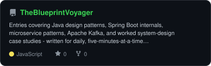
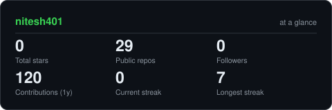

 

 

## About

<table>
<tr>
<td width="220" align="center" valign="top">
  
</td>
<td valign="top">

I'm a **Java backend developer** building REST services and microservices with Spring Boot. I've worked on backend systems since 2021 and am currently a **Consultant at Deloitte USI** (since April 2025), after time at **CGI** and **Techsophy**.

I care about code that stays maintainable: clear boundaries, predictable APIs, solid tests. I'm drawn to event-driven design with Kafka, system design, and secure service-to-service communication with OAuth2, OpenID Connect and Keycloak. I also use AI tooling (Claude Code, GitHub Copilot) in day-to-day development and keep experimenting with where it helps and where it doesn't.

</td>
</tr>
</table>

## Technology

| | |
|---|---|
| **Language** |  |
| **Backend** |      |
| **Data** |   |
| **Messaging** |  |
| **Security** |    |
| **Quality** |   |
| **Tooling** |     |

Broader exposure (self-reported)

 

Technologies I've used beyond the core stack above, not all of them with public repositories:

- **Java ecosystem:** Java 11/17, Spring WebFlux, Spring Data, Micronaut, Quarkus, GraphQL, gRPC
- **Data:** PostgreSQL, MySQL, MongoDB, Redis
- **Infrastructure and delivery:** Kubernetes, Helm, Terraform, Ansible, Jenkins, GitHub Actions, ArgoCD, Docker Compose, Prometheus, Grafana, Azure, AWS, GCP
- **Claude API:** summarization, code review, conversational assistants, retrieval-augmented generation, test-case generation

## Featured work

<!-- Cards are generated by scripts/cards.py from assets/projects.json.
     Stars, forks and language are pulled from the API on each run. -->
<table>
<tr>
<td width="50%">
  <a href="https://github.com/nitesh401/TheBlueprintVoyager">
    <picture>
      <source media="(prefers-color-scheme: dark)"  srcset="assets/card-TheBlueprintVoyager-dark.svg">
      <source media="(prefers-color-scheme: light)" srcset="assets/card-TheBlueprintVoyager-light.svg">
      
    </picture>
  </a>
</td>
</tr>
</table>

| Project | Demo | Stack |
|---|---|---|
| **[TheBlueprintVoyager](https://github.com/nitesh401/TheBlueprintVoyager)** | [Live site](https://nitesh401.github.io/TheBlueprintVoyager/) | `Java` `Spring Boot` `System Design` |

<!-- To add a project: add an entry to assets/projects.json, let scripts/cards.py
     regenerate the cards, then add a row to the table above. Only list public
     repositories you are comfortable showcasing. -->

## Engineering principles

- **Boundaries first.** Controllers handle HTTP, services hold rules, repositories talk to the database. Mixing them is where maintenance cost starts.
- **Validate at the edge.** Treat every API input as untrusted and fail early with clear error responses.
- **Be deliberate with transactions.** Know the isolation level, the lock scope and what happens under concurrent writes.
- **Design for failure.** Timeouts, retries with limits, idempotent consumers, and enough logging to explain what happened.
- **Events over coupling.** Where it fits, publish facts through Kafka instead of calling services in chains, and accept eventual consistency knowingly.
- **Security is part of the design.** Delegate identity to a standard provider (OAuth2/OIDC, Keycloak) rather than inventing it.
- **Tests that earn their keep.** Fast unit tests with JUnit and Mockito, plus integration tests at the seams that matter.

## AI-assisted development

I use **Claude Code** and **GitHub Copilot** as working tools, mainly for:

- drafting and extending unit tests
- refactoring and code review second opinions
- exploring unfamiliar code and generating boilerplate

AI output gets reviewed like any other code: it has to pass the tests, fit the design and be something I can explain.

## GitHub activity

<!-- 3D calendar, regenerated by .github/workflows/metrics.yml -->

 

<!-- Stats cards are generated into this repo by scripts/cards.py instead of using
     shared public instances that can go down and break the section. -->
<picture>
  <source media="(prefers-color-scheme: dark)"  srcset="assets/card-stats-dark.svg">
  <source media="(prefers-color-scheme: light)" srcset="assets/card-stats-light.svg">
  
</picture>

 

<picture>
  <source media="(prefers-color-scheme: dark)"  srcset="assets/radar-langs-dark.svg">
  <source media="(prefers-color-scheme: light)" srcset="assets/radar-langs-light.svg">
  
</picture>

<!-- Kept from the previous version, hidden because they duplicate the above or
     are self-rated. Uncomment to restore.

<picture>
  <source media="(prefers-color-scheme: dark)"  srcset="assets/radar-dark.svg">
  <source media="(prefers-color-scheme: light)" srcset="assets/radar-light.svg">
  
</picture>

<picture>
  <source media="(prefers-color-scheme: dark)"  srcset="https://raw.githubusercontent.com/nitesh401/nitesh401/output/snake-dark.svg">
  <source media="(prefers-color-scheme: light)" srcset="https://raw.githubusercontent.com/nitesh401/nitesh401/output/snake.svg">
  
</picture>

-->

## Experience

| Role | Company | Period |
|---|---|---|
| Consultant, Java backend | **Deloitte USI** | April 2025 – present |
| Software Engineer | **CGI** | previous |
| Backend developer | **Techsophy** | previous |

Client and project details are intentionally left out.

## Contact

Also at [niteshrawal.is-a.dev](https://niteshrawal.is-a.dev/)

 

`01110100 01101000 01100001 01101110 01101011 01110011`

